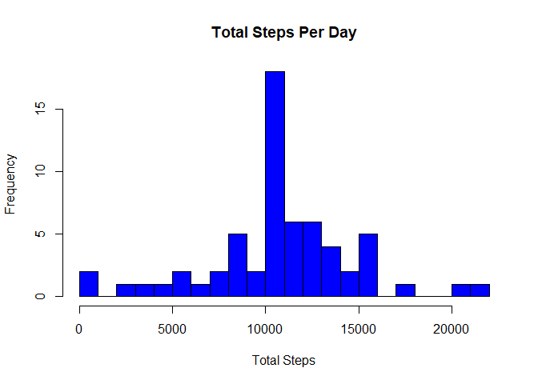

## Loading and preprocessing the data

- Load the data from csv file

```r
  if(!file.exists('activity.csv')){
    unzip('activity.zip')
  }
  activityData <- read.csv('activity.csv')
```

- Process the input data into POSIX date format

```r
  activityData$date <- as.POSIXct(strptime(activityData$date, "%Y-%m-%d"), tz="")
  activityData$time <- sprintf("%04d", activityData$interval)
  activityData$time <- as.POSIXct(activityData$time, "%H%M", tz="")
```

## What is mean total number of steps taken per day?

- Aggregate the data into a new data frame containing the total number of steps per day

```r
  totalStepsByDay <- aggregate(list(total_steps = activityData$steps), by = list(date = activityData$date), FUN = sum, na.rm = TRUE)
```

- Histogram of total steps per day

```r
  hist(totalStepsByDay$total_steps,
     breaks=30,
     xlab="Total Steps",
     main="Total Steps Per Day",
     col="blue")
```

<!-- -->

- Calculate the mean and median number of steps per day

```r
  stepsByDayMean <- mean(totalStepsByDay$total_steps)
  stepsByDayMedian <- median(totalStepsByDay$total_steps, na.rm = TRUE)
```
The Mean is : 9354.2295082 and the Median is : 10395

## What is the average daily activity pattern?

- Aggregate the average number of steps for each time interval

```r
  averageStepsByTime <- aggregate(list(average_steps = activityData$steps),
      by = list(time = activityData$time,
      interval = activityData$interval),
      FUN = mean,
      na.rm = TRUE)
```

- Make a time series plot

```r
  plot(average_steps ~ time,
      data = averageStepsByTime,
      xlab = "Time interval",
      ylab = "Mean steps",
      main = "Mean Steps By Time Interval",
      type = "l",
      col = "blue",
      lwd = 2)
```

<!-- -->

- Determine the interval with the maximum average number of steps

```r
	timeMostSteps <- gsub("([0-9]{1,2})([0-9]{2})", "\\1:\\2", 
		averageStepsByTime[which.max(averageStepsByTime$average_steps),'interval'])
```
Most Steps are at : 8:35

## Imputing missing values

- Calculate and report the total number of missing values in the dataset

```r
  numMissingValues <- length(which(is.na(activityData$steps)))
```
Number of missing values : 2304

- Use the average number of steps for the time interval to fill in all of the missing values

```r
	activityNew <- merge(activityData, averageStepsByTime, by = "interval")
	activityNew <- within(activityNew,
		steps <- ifelse(is.na(activityNew$steps),
		activityNew$average_steps,
		activityNew$steps))	
```

- Calculate the total number of steps per day with the new values	

```r
	totalStepsByDayNew <- aggregate(list(total_steps = activityNew$steps),
		by = list(date = activityNew$date),
		FUN = sum,
		na.rm = FALSE)
```

- Histogram of total steps per day for the new values

```r
	hist(totalStepsByDayNew$total_steps,
		 breaks=30,
		 xlab="Total Steps",
		 main="Total Steps Per Day",
		 col="blue")
```

<!-- -->

- Calculate the mean and median number of steps per day for the new values

```r
	stepsByDayMeanNew <- mean(totalStepsByDayNew$total_steps)
	stepsByDayMedianNew <- median(totalStepsByDayNew$total_steps)
```
The Mean is : 1.0766189\times 10^{4} and the Median is : 1.0766189\times 10^{4}

Remarks:  
1. The mean and median total number of steps are now equal.   
2. Compared to the initial data set the new values are higher.   
3. Estimates of the total daily number of steps are higher in the new dataset.

## Are there differences in activity patterns between weekdays and weekends?

- Create a new factor variable in the dataset with two levels - "weekday" and "weekend" indicating whether a given date is a weekday or weekend day

```r
  Sys.setlocale(category = "LC_ALL", locale = "english")
```

```
## [1] "LC_COLLATE=English_United States.1252;LC_CTYPE=English_United States.1252;LC_MONETARY=English_United States.1252;LC_NUMERIC=C;LC_TIME=English_United States.1252"
```

```r
  activityNew$weekday <- weekdays(activityNew$date)
  activityNew$weekend_indicator <- as.factor(apply(activityNew["weekday"], 1, 
	function(x) { switch(x, "Sunday" = "weekend", "Saturday" = "weekend", "weekday")}))
```

- Make a panel plot containing a time series plot comparing activity patterns on weekdays and weekends

```r
	averageStepsByTimeWeekend <- aggregate(list(average_steps = activityNew$steps),
		by = list(time = activityNew$time.x, daytype = activityNew$weekend_indicator),
		FUN = mean)	

	library(ggplot2)
	qplot(x = time,
		  y = average_steps,
		  geom="path",
		  data = averageStepsByTimeWeekend, 
		  xlab="Time interval",
		  ylab="Average steps",
		  main="Activity Patterns\nWeekdays vs. Weekends",
		  facets = daytype ~ .)
```

<!-- -->


